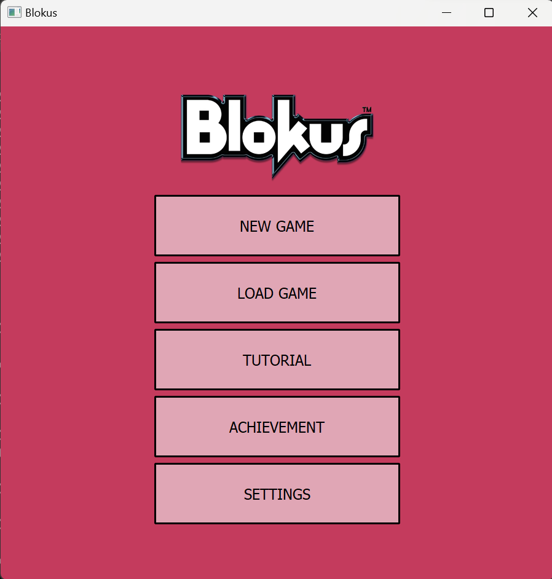
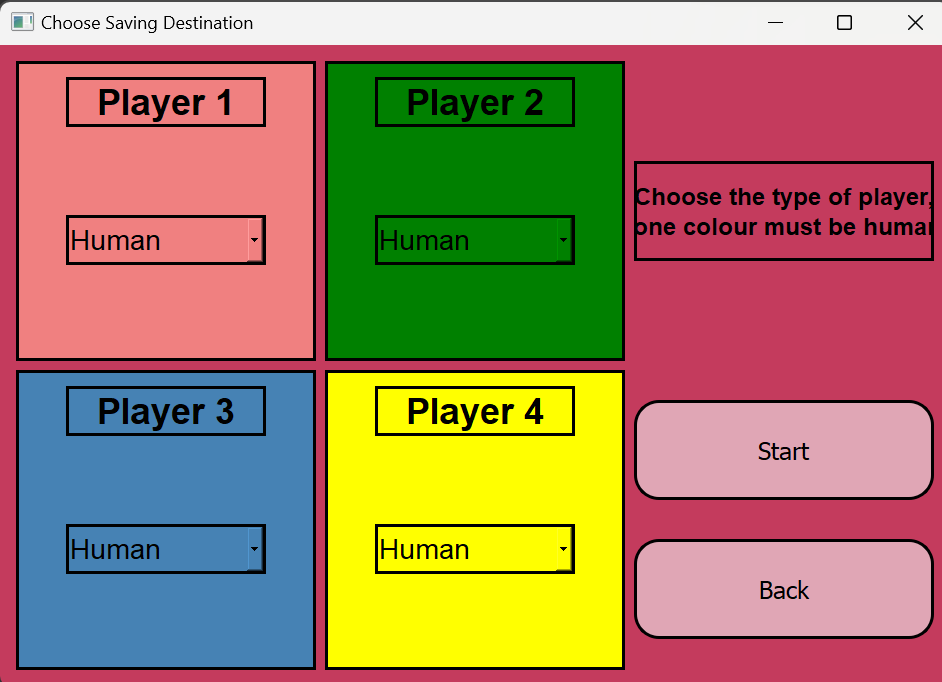
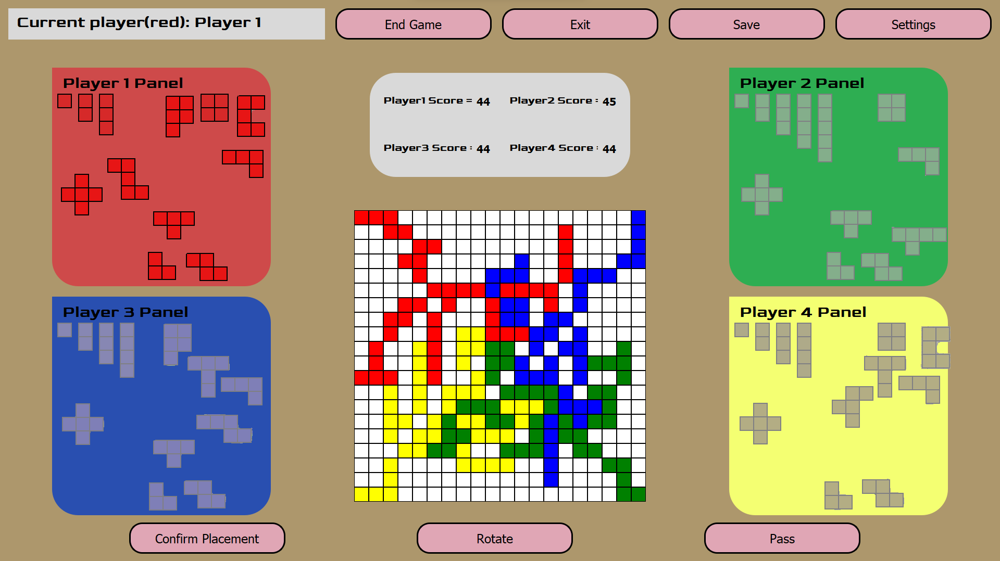
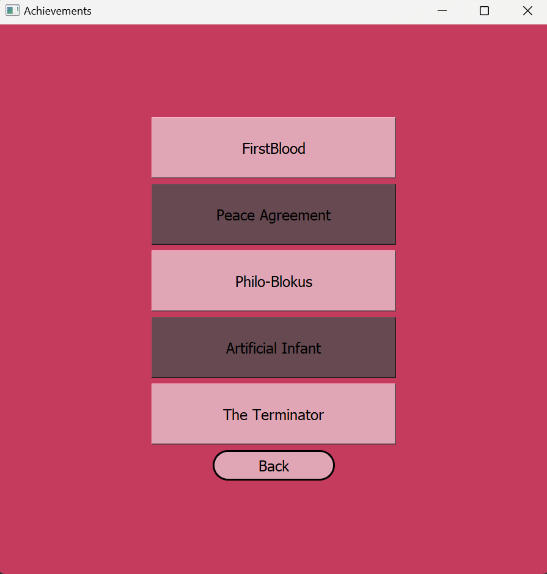
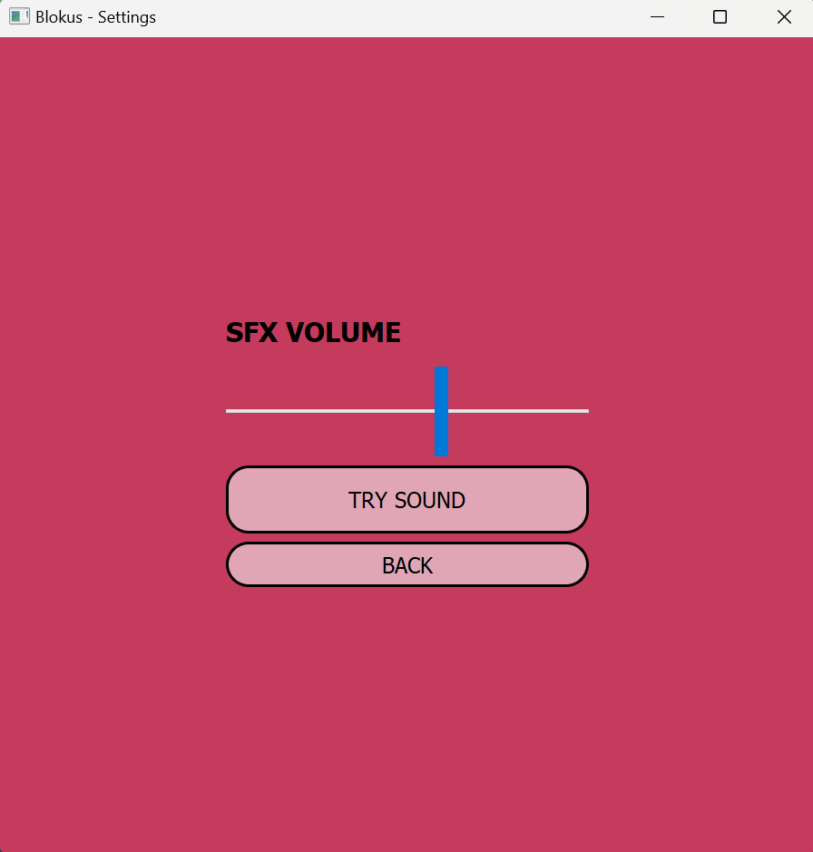
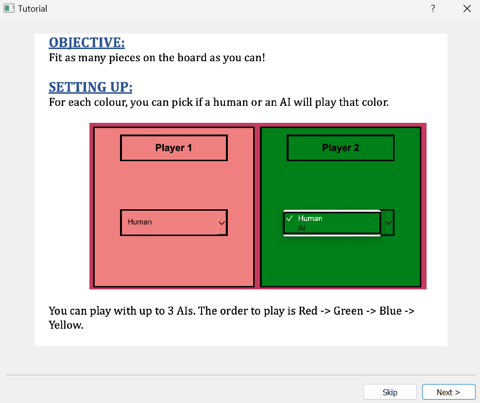

# Blokus Game

[](https://opensource.org/licenses/MIT)

## Introduction

The Blokus Game is an exciting and challenging board game implemented as a desktop application using PyQt. This README provides an overview of the game, its features, installation instructions, and details on how to use it.

Blokus is a strategy board game that brings together simplicity and complexity in an engaging way. It can be played by two to four players, each attempting to place as many of their pieces on the board as possible while blocking opponents from doing the same. The game offers a mix of tactical thinking and competitive fun, making it an ideal choice for players of all ages.

## Features

- **Main Menu:** Start a new game, load a saved game, explore achievements, or configure game settings.
- **Player Customization:** Choose the number of human and AI players before starting a new game.
- **Achievements:** Unlock achievements during gameplay and view them in the Achievements menu.
- **Gameplay:** Experience the excitement of Blokus with a sleek and intuitive user interface.
- **Settings:** Adjust sound effects volume to your preference.
- **Tutorial:** Learn how to play Blokus with an interactive tutorial.

## Installation

To run the Blokus Game on your system, follow these steps:

1. **Clone the Repository:** Use Git to clone this repository to your local machine:

```
git clone https://github.com/yourusername/blokus-game.git
```

2. **Install Dependencies:** Make sure you have Python 3 and PyQt5 installed on your system. If not, you can install PyQt5 using pip:

```
pip install PyQt5
```

3. **Change Directory:** Navigate to the project directory

```
cd path/to/directory/phase3_code
```

4. **Run the Game:** Run the main script:

```
python game.py
```

or
run using your debugger of choice (e.g., extension)

This will start the Blokus Game application.

## Usage

- **Main Menu:** You'll be greeted with the main menu when you launch the game. From here, you can start a new game, load a saved game, access achievements, or configure settings.



- **Player Customization:** Before starting a game, customize the number of human and AI players.



- **Gameplay:** Enjoy the Blokus gameplay, aiming to place your pieces strategically while blocking your opponents.




- **Achievements:** Unlock achievements during gameplay and view them in the Achievements menu.



- **Settings:** Adjust the sound effects volume to your liking.



- **Tutorial:** If you're new to Blokus, explore the interactive tutorial to learn the rules.


